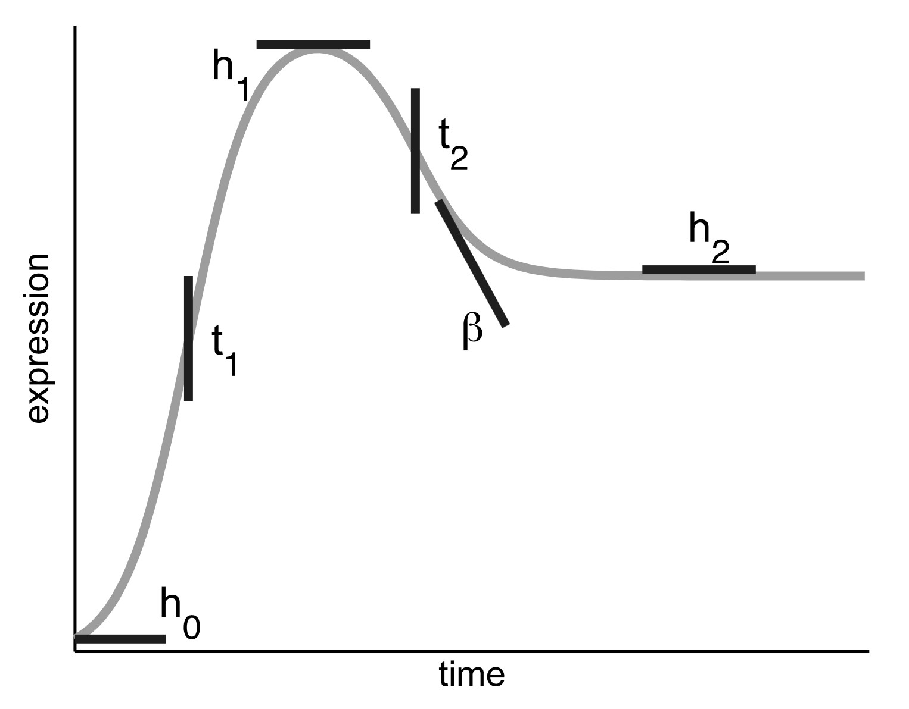
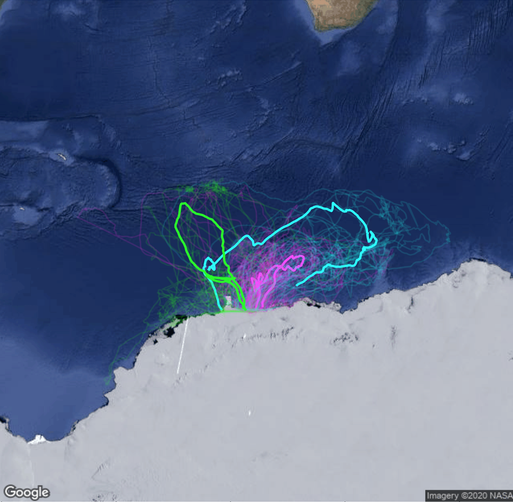

## About me

My name is Ethan Ashby, and I am a senior mathematics major concentrating in statistics at Pomona College. I’m interested in the application of statistical methods to problems in biology, particularly in the fields of statistical genomics, machine learning, and oncology research.
When I'm not doing stats, I enjoy running, bicycling, & hiking!

---

### Research Projects

[Using somatic variant richness for primary site classification in human cancer](/MSK Presentation slides.pdf)
 

Identifying a cancer's tissue of origin from its genome sequence is an important challenge in precision oncology, particularly for the classification of tumors of unknown origin, diagnosis of metastatic disease, or in emerging diagnostic methods like liquid biopsy. During the summer of 2020, I worked in the Department of Epidemiology and Biostatistics at Memorial Sloan Kettering Cancer Center under the mentorship of Dr. Ronglai Shen and Dr. Saptarshi Chakraborty to extract tissue specific signals from rare mutations in the cancer genome. The vast majority of mutations in human cancer are rare: in The Cancer Genome Atlas (TCGA), >90% of mutations occur only once. My mentors previously developed nonparametric Bayesian probability methods from computational linguistics and ecology to use rare mutation frequencies to estimate the probabilities of encountering new or previously unseen variants in major cancer genes under different tissue contexts (Chakraborty et al., Nature Communications 10:1-9, 2019). Under their mentorship, I developed a framework to extend this analysis to all genes in the human genome using machine learning methods and knowledge of features that drive mutational heterogeneity in cancer. I am continuing to work on this project for my senior thesis with the goal of developing an information-theoretic clustering approach to identify gene groups with rare variant patterns of high clinical relevance.

---
[Analysis of Time Course RNA-Seq Data in E. coli and T. brucei](/sample_page)
 

Beginning in the summer of 2019 at the Harvey Mudd Data Science REU, I explored the Impulse models (Chechik & Koller, Comput. Biol. 16:279–290, 2009), a scaled product of two sigmoidal functions, and its utility in modeling time course RNA-seq data. I've conducted methodological inquiry into the model's properties and improving the model fitting procedure. I've also conducted practical (biological) research, applying this model to time course RNA-Sequencing datasets in E. coli and T. brucei (a human parasite that causes sleeping sickness).

---
[Analysis of Antarctic Petrel Foraging Trips](https://ethanashby.github.io/Petrel-Foraging/)
 

In the spring of 2020, I visualized and analyzed GPS data for 150 Antarctic Petrel forage trips over the austral summers between 2012-2014. I identified that petrel foraging trip length was highly variable from year to year and used PAM clustering to identify prototype petrel foraging paths. When I integrated the GPS data with remote sensing data for several climatic variables, I identified a phenomenon where petrels tended to forage in regions of low to moderate sea ice cover, corresponding to the sea ice edge. This finding was supported by the scientific literature (Delord, K. et al., R. Soc. Open Sci. 7, 2020). This project represented a data-driven approach to understand the ecology of an important Antarctic sentinel species. 

---

### Links

- [Project 1 Title](http://example.com/)
- [Project 2 Title](http://example.com/)
- [Project 3 Title](http://example.com/)
- [Project 4 Title](http://example.com/)
- [Project 5 Title](http://example.com/)

---

---

Page template forked from <a href="https://github.com/evanca/quick-portfolio">evanca</a>

<!-- Remove above link if you don't want to attibute -->
