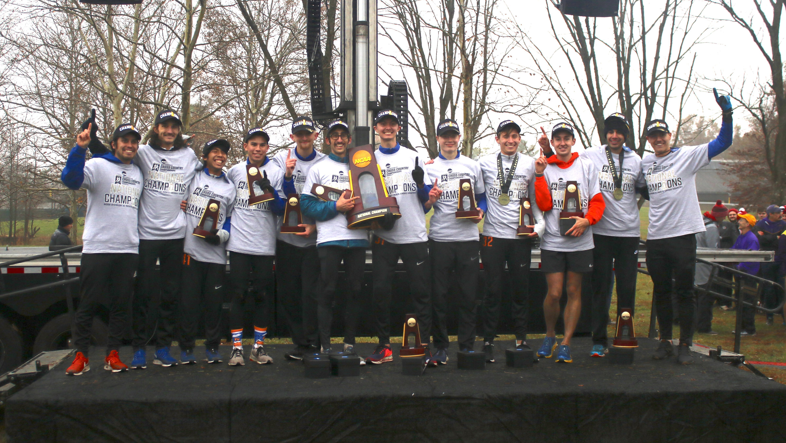
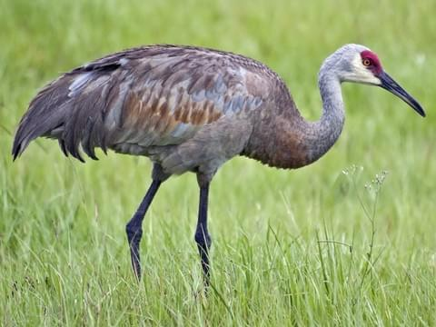

## About me

My name is Ethan Ashby, and I am a senior mathematics major concentrating in statistics at Pomona College. I’m interested in the application of statistical methods to problems in biology, particularly in the fields of statistical genomics, machine learning, and oncology research.
When I'm not doing stats, I enjoy running, bicycling, & hiking!

---

### Research Projects

[Using somatic variant richness for primary site classification in human cancer](/MSKResearch.md)
 

  

Under the mentorship of two Memorial Sloan Kettering Cancer Center Biostatisticians, I developed a framework that combined Bayesian nonparametric methods developed in the fields of computational linguistics and ecology, machine learning methods, and knowledge of what factors drive mutational heterogeneity in cancer, to aggregate rare mutation data for important clinical purposes.

---
[Analysis of Time Course RNA-Seq Data in E. coli and T. brucei](/Impulse.md)
 

  

Beginning in the summer of 2019 at the Harvey Mudd Data Science REU, under the mentorship of Professors Johanna Hardin, Daniel Stoebel, and Danae Schulz, I explored the Impulse model, a scaled product of two sigmoidal functions, and its utility in modeling time course RNA-seq data. The model presents a number of advantages, among them, the ability to measure when genes turn on. My work has concerned the model's properties, fitting procedure, and its applications to time course RNA-Sequencing datasets in *E. coli* and *T. brucei* (a human parasite that causes sleeping sickness).

---
[Analysis of Antarctic Petrel Foraging Trips](/Petrel.md)
 

  

In the spring of 2020, I visualized and analyzed GPS data for 150 Antarctic Petrel forage trips over the austral summers between 2012-2014. I identified that petrel foraging trip length was highly variable from year to year and used PAM clustering to identify prototype petrel foraging paths. When I integrated the GPS data with remote sensing data for several climatic variables, I identified a phenomenon where petrels tended to forage in regions of low to moderate sea ice cover, corresponding to the sea ice edge. This finding was supported by the scientific literature (Delord, K. et al., R. Soc. Open Sci. 7, 2020). This project represented a data-driven approach to understand the ecology of an important Antarctic sentinel species. 

---
[Simulating DIII National Cross Country Meets](/running.md)

  

I am a NCAA Division III Cross Country runner, and much of my time out of class is spent training to compete in long distance running races. These races are notoriously difficult to predict, since performance is stochastic and a variety of factors can influence a race. Along with two classmates and teammates, we worked on a project to simulate NCAA DIII National Cross Country meets from publically-available race data, to identify which teams overperformed and underperformed at the 2018 and 2019 national meets. I was fortunate enough to compete in the 2019 NCAA meet, where I helped Pomona-Pitzer capture its first national championship in school history.

---
[Datafest 2019: Travel and Player Fatigue on the Canadian National Rugby Team](/MSKResearch.md)

---
[Grant Proposal: Analysis of Sandhill Crane Istopic Ratios](/Avian Project Final.pdf)

  

In the spring of 2020, I wrote a mock grant proposal to use isotopic (C13) ratios in museum specimens of Sandhill Cranes from the Eastern Flyway to measure temporal trends in corn consumption by this once endangered avian species. This represented a well-researched and thoughtfully-concieved approach to leveraging museum specimens for interesting historical ecology research. Additionally, as climate change affects the agriculture of the American Heartland, this project could be useful for projecting the impacts on this important species. In the link above, you can access a pdf of my proposal.

---

### Links

- [NCAA Division III National Cross Country Championships Recap](https://tsl.news/cross-country-ncaa-championship/)
- [Project 2 Title](http://example.com/)
- [Project 3 Title](http://example.com/)
- [Project 4 Title](http://example.com/)
- [Project 5 Title](http://example.com/)

---

---

Page template forked from <a href="https://github.com/evanca/quick-portfolio">evanca</a>

<!-- Remove above link if you don't want to attibute -->
